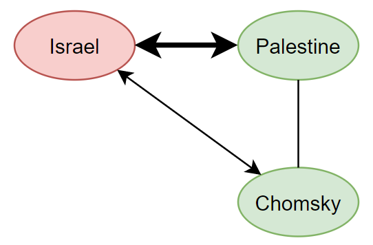

All In All, Another Brick In The Motte
=============
[Original](https://slatestarcodex.com/2014/11/04/ethnic-tension-and-meaningless-arguments/) by Scott Alexander

[Prereading](https://www.lesswrong.com/posts/yCWPkLi8wJvewPbEp/the-noncentral-fallacy-the-worst-argument-in-the-world)

Post-modernists sometimes say things like “reality is socially constructed”, and there’s an uncontroversially correct meaning there. We don’t experience the world directly, but through the categories and prejudices implicit to our society; for example, I might view a certain shade of bluish-green as blue, and someone raised in a different culture might view it as green. Sounds fine.

Then post-modernists go on to say that if someone in a different culture thinks that the sun is light glinting off the horns of the Sky Ox, that’s just as real as our own culture’s theory that the sun is a mass of incandescent gas. If you challenge them, they’ll say that you’re denying reality is socially constructed, which means you’re clearly naive and think you have perfect objectivity and the senses perceive reality directly.

This kind of argument resembles a medieval castle, where there would be a crop field called a bailey, and a big stone tower in the middle called the motte. If you were a medieval lord, you would work the crop field most of the time. If an enemy approached, you would retreat to the motte and rain down arrows on the enemy until they gave up and went away. Then you would go back to the bailey, which is the place you wanted to be all along.

So the motte-and-bailey fallacy is when you make a bold, controversial statement. If somebody challenges you, you retreat to an obvious, uncontroversial statement, so you’re clearly right and they’re silly for challenging you. When the argument is over you go back to making the bold, controversial statement. It's a common but successful form of goalpost shifting.

Some classic examples:

1. Proponents of pseudoscience sometimes argue that their particular form of quackery will cure cancer or take away your pains or heal your crippling injuries (bailey). When confronted with evidence that it doesn’t work, they might argue that people need hope, and even a placebo solution will often relieve stress and help people feel cared for (motte). In fact, some have argued that quackery may be better than real medicine for certain untreatable diseases, because neither real nor fake medicine will help, but fake medicine tends to be more calming and has fewer side effects. But then once you leave the quacks in peace, they will go back to telling less knowledgeable patients that their treatments will cure cancer.

2. Critics of the rationalist community note that it pushes controversial complicated things like Bayesian statistics and utilitarianism (bailey) under the name “rationality”, but when asked to justify itself defines rationality as “whatever helps you achieve your goals”, which is so vague as to be universally unobjectionable (motte). Then once you have admitted that more rationality is always a good thing, they suggest you’ve admitted everyone needs to learn more Bayesian statistics.

3. Some people believe in a technological singularity, with a super intelligent AI inventing new technologies every few minutes (bailey). If you argue this is unlikely they will counter that “technological singularity” just means “a time when technology is so different that it is impossible to imagine" and who would deny that technology will probably get really weird (motte)? But then every other time they use “singularity”, they use it to refer to a very specific scenario of intelligence explosion, which needs a lot more evidence.

4. Generally speaking, people pushing just about any policy position (bailey) will invoke the motivation (motte) if they feel attacked. If someone is arguing for affirmative action for some group and they hear arguments against it, they can just say "but how can you be against equality for this group!?". Now the other person has clarify that's definitely not what they meant.

The motte and bailey sounds kind of stupid and hard-to-fall-for when you put it like that, but all fallacies sound that way _when you’re thinking about them_. It draws its strength from people’s usual failure to debate specific propositions rather than vague clouds of ideas. If I’m debating “does quackery cure cancer?”, it might be easy to view that as a general case of the problem of “is quackery okay?” or “should quackery be illegal?”, and from there it’s easy to bring up the motte objection.

Recently, a friend (I think it was Robby Bensinger) pointed out something I’d totally missed. The motte-and-bailey doctrine is a perfect mirror image of my other favorite fallacy, the weak man fallacy.

Weak-manning is a lot like straw-manning, except that instead of debating a fake, implausibly stupid opponent, you’re debating a real, unrepresentatively stupid opponent. For example, “_Religious people say that you should kill all gays. But this is evil. Therefore, religion is wrong and barbaric. Therefore we should all be atheists._” There are certainly religious people who think that you should kill all gays, but they’re a small fraction of all religious people and not the ones an unbiased observer would hold up as the best that religion has to offer.

So weak-manning is replacing a strong position with a weak position to better attack it; motte-and-bailey is replacing a weak position with a strong position to better defend it. This means people who know both terms are at constant risk of arguments of the form “You’re weak-manning me!” “No, you’re motte-and-baileying me!“.

Suppose we’re debating feminism. I defend it by saying "women need to be treated equally". You attack it by saying that feminists think "all men are terrible". I can accuse you of attacking the weakest statement any feminist has ever pushed, and you can accuse me of defending an uncontroversially statement.

But why does this kind of goalpost shifting work? What is the real "feminism" we should be debating? Who knows!? It's way easier to just say “Here’s a vague concept, feminism, ___quick___, should we think positively or negatively about it?”

### Ethnic Tension And Meaningless Arguments
When everything works the way it’s supposed to in philosophy textbooks, arguments are supposed to go one of a couple of ways:

* Questions of empirical fact, like “Did aliens build the pyramids?”. You debate these by presenting factual evidence, like “One of the bricks at Giza says ‘Made In Tau Ceti V’ on the bottom.” Then people try to refute these facts or present facts of their own.

* Questions of morality, like “Should you refrain from downloading music you have not paid for?” You can only debate questions aroud morality well if you’ve already agreed upon a moral framework, like consequentialism. But you can sort of debate them by comparing to examples of agreed-upon moral questions and trying to maintain consistency. For example, “You wouldn’t download a car.”

If you are very lucky, your philosophy textbook will also admit the existence of:

* Questions of policy, like “We should raise the minimum wage”. These are combinations of competing factual claims and competing values. Minimum wage discussions might hinge on factual claims like “Raising the minimum wage would increase unemployment” or “It is very difficult to live on the minimum wage nowadays, and many poor families cannot afford food.” But it might also hinge on value claims like “Corporations owe it to their workers to pay a living wage,” or “It is more important that the poorest be protected than that the economy be strong.” If you can resolve all of these factual and value claims, you should be able to agree on questions of policy.

None of these questions seem to allow the sort of vagueness needed for a motte and bailey to work.

### II

Question: Are you pro-Israel or pro-Palestine? Pause and actually think about it.

So some people probably answered pro-Israel, others pro-Palestine, and others probably said they were neutral because it’s a complicated issue with good points on both sides.

Probably very few people answered: "What does that question even mean?"

It doesn’t fall into any of the three forms of argument above. It’s not a question of fact, it’s not a question of specific moral truths, and it’s not a question of policy. There are closely related policies, like whether Palestine should be granted independence. But if I support a very specific two-state solution where the border is drawn upon the _something-th_ parallel, does that make me pro-Israel or pro-Palestine? At exactly which parallel of border does the solution under consideration switch from pro-Israeli to pro-Palestinian? Do you think the crowd of people shouting and waving signs saying “SOLIDARITY WITH PALESTINE” have an answer to that question?

And this question covers even more than just the borders of an independent Palestinian state. Was Israel justified by responding to Hamas’ rocket fire by bombing Gaza, even with the near-certainty of collateral damage? Was Israel justified in building a wall across the Palestinian territories to protect itself from potential terrorists, even though it severely curtails Palestinian freedom of movement? Do Palestinians have a “right of return” to territories taken in the 1948 war? Who should control the Temple Mount?

These are four very different questions which one would think each deserve independent consideration. But in reality, how many peoples answers depend on this “pro-Palestine vs. pro-Israel” factor? 50%? 75%? More?

In a way, when we round people off to the Philosophy 101 kind of arguments, we are failing to respect their self-description. People aren’t out on the streets saying “By my cost-benefit analysis, Israel was in the right to invade Gaza, although it may be in the wrong on many of its other actions.” They’re waving little Israeli flags and holding up signs saying “ISRAEL: OUR STAUNCHEST ALLY”. Maybe we should take them at face value.

This is starting to look related to the original question. Why is it okay to suddenly switch points in the middle of an argument? In the case of Israel and Palestine, it might be because people’s support for any particular Israeli policy is better explained by a General Factor Of Pro-Israeliness than by the policy itself. As long as I’m arguing in favor of Israel in some way, it’s still considered by everyone to be the same topic.

### III

Some moral philosophers got fed up with nobody being able to explain what the heck a moral truth was and invented emotivism. Emotivism says there are no moral truths, just expressions of little personal bursts of emotion. When you say “Donating to charity is good,” you don’t mean “Donating to charity increases the sum total of utility in the world,” or “Donating to charity is in keeping with the Platonic moral law” or “Donating to charity was commanded by God” or even “I like donating to charity”. You’re just saying “Yay charity!” and waving a little flag.

Seems a lot like how people handle the Israel question. “I’m pro-Israel” doesn’t necessarily imply that you believe any empirical truths about Israel, or believe any moral principles about Israel, or even support any Israeli policies. It means you’re waving a little flag with a Star of David on it and cheering.

So here is Ethnic Tension: A Game For Two Players. Pick a vague concept, “Israel” will do nicely for now.

Player 1 tries to associate the concept “Israel” with as much good karma as they possibly can. Concepts get good karma by doing good moral things, by being associated with good people, by being linked to the beloved in-group, and by being oppressed underdogs who are brave just by taking this position.

“Israel is the freest and most democratic country in the Middle East. It is one of America’s strongest allies and shares our Judeo-Christian values.

Player 2 tries to associate the concept “Israel” with as much bad karma as they possibly can. Concepts get bad karma by committing atrocities, being associated with bad people, being linked to the hated out-group, and by being the oppressors.

“Israel may have some level of freedom for its most privileged citizens, but what about the millions of people in the Occupied Territories that have no say? Israel is involved in various atrocities and has often killed innocent protesters. They are essentially a neocolonialist state and have allied with other neocolonialist states like South Africa.”

The prize for winning this game is the ability to win the other three types of arguments. If Player 1 wins, the audience ends up with a strongly positive General Factor Of Pro-Israeliness, and vice versa.

Remember, people’s capacity for motivated reasoning is pretty much infinite. Remember, a motivated skeptic asks if the evidence compels them to accept the conclusion; a motivated credulist asks if the evidence allows them to accept the conclusion. Remember, Jonathan Haidt and his team hypnotized people to have strong disgust reactions to the word “often”, and then tried to hold in their laughter when people in the lab came up with convoluted yet plausible-sounding arguments against any policy they proposed that included the word “often” in the description.

I’ve never heard of the experiment being done the opposite way, but it sounds like the sort of thing that would work. Once you finish the Ethnic Tension Game, you’re replicating Haidt’s experiment with the word “Israel” instead of the word “often”. Win the game, and any pro-Israel policy you propose will get a burst of positive feelings and tempt people to try to find some explanation, any explanation, that will justify it, whether it’s invading Gaza or building a wall or controlling the Temple Mount.

So this is a fourth type of argument, the kind that doesn’t make it into Philosophy 101 books. The trope name is Ethnic Tension, but it applies to anything that can be identified as a Vague Concept, or paired and opposing Vague Concepts, which you can use emotivist thinking to load with good or bad karma.

### IV

Now motte-and-bailey stands revealed. Again, if I can load the concept of “feminism” with good karma by making it so obvious nobody can disagree with it, then I have a massive “home field advantage” when I’m trying to convince anyone of any particular policy that can go under the name “feminism”, even if it's unrelated to the arguments that gave feminism good karma in the first place.

On the other hand, I could just post quotes from the ten most offensive feminists on Tumblr, again and again, until the entire movement seems ridiculous and evil. Then you’ll have trouble convincing anyone of anything feminist. Compare: most Americans oppose Obamacare, but most Americans support each individual component of Obamacare when it is explained without using the word “Obamacare”.

### V

Diagrams make everything better. We have our node “Israel”, which has either good or bad karma. Then there’s another node close by marked “Palestine”. We would expect these two nodes to be pretty anti-correlated. When Israel has good karma, Palestine has bad karma, and vice versa.

Now suppose you listen to Noam Chomsky talk about how strongly he supports the Palestinian cause and how much he dislikes Israel. One of two things can happen:

1. “Wow, a great man such as Noam Chomsky supports the Palestinians! They must be very deserving of support indeed!”
2. “That idiot Chomsky supports Palestine? Well, screw him. And screw them!”

So now there is a third node, Noam Chomsky, that connects to both Israel and Palestine, and we have discovered it is positively correlated with Palestine and negatively correlated with Israel. It probably has a pretty low weight, because there are a lot of reasons to care about Israel and Palestine other than Chomsky, and a lot of reasons to care about Chomsky other than Israel and Palestine, but the connection is there.

Over time as you learn more, this structure eventually reaches some kind of equilibrium. If we start with someone liking Israel and Chomsky, but not Palestine, then either that’s going to shift a little bit towards liking Palestine, or shift a little bit towards disliking Chomsky.

Now we add more nodes. Cuba seems to really support Palestine, so they get a positive connection with a little bit of weight there. And I think Noam Chomsky supports Cuba, so we’ll add a connection there as well. Cuba is socialist, and that’s one of the most salient facts about it, so there’s a heavily weighted positive connection between Cuba and socialism. Palestine kind of makes noises about socialism but I don’t think they have any particular economic policy, so let’s say very weak direct connection. And Che is heavily associated with Cuba, so you get a pretty big Che – Cuba connection, plus a strong direct Che – socialism one. And those pro-Palestinian students who threw rotten fruit at an Israeli speaker also get a little path connecting them to “Palestine” – hey, why not – so that if you support Palestine you might be willing to excuse what they did and if you oppose them you might be a little less likely to support Palestine.

Back up. This model produces crazy results, like that people who like Che are more likely to oppose Israel bombing Gaza. That’s such a weird, implausible connection that it casts doubt upon the entire…

Oh. That really is how it works.

I think this kind of model, in its efforts to sort itself out into an equilibrium state, might settle on some kind of General Factor Of Politics, which would probably correspond pretty well to the left-right axis.

In Five Case Studies On Politicization, I noted how fresh new unpoliticized issues, like the Ebola epidemic, were gradually politicized by connecting them to other ideas that were already part of a political narrative. For example, a quarantine against Ebola would require closing the borders. So now there’s a weak negative link between “Ebola quarantine” and “open borders”. If your “open borders” node has good karma, now you’re a little less likely to support an Ebola quarantine. If “open borders” has bad karma, a little more likely.

I also tried to point out how you could make different groups support different things by changing your narrative a little:
> Global warming has gotten inextricably tied up in the Blue Tribe narrative: Global warming proves that unrestrained capitalism is destroying the planet. Global warming disproportionately affects poor countries and minorities. Global warming could have been prevented with multilateral action, but we were too dumb to participate because of stupid American cowboy diplomacy. Global warming is an important cause that activists and NGOs should be lauded for highlighting. Global warming shows that Republicans are science denialists and probably all creationists. Two lousy sentences on “patriotism” aren’t going to break through that.

If I were in charge of convincing the Red Tribe to line up behind fighting global warming, here’s what I’d say:

> In the 1950s, brave American scientists shunned by the climate establishment of the day discovered that the Earth was warming as a result of greenhouse gas emissions, leading to potentially devastating natural disasters that could destroy American agriculture and flood American cities. As a result, the country mobilized against the threat. Strong government action by the Bush administration outlawed the worst of these gases, and brilliant entrepreneurs were able to discover and manufacture new cleaner energy sources. As a result of these brave decisions, our emissions stabilized and are currently declining.

> As we do our part, the authoritarian governments of Russia and China continue to industralize and militarize rapidly as part of their bid to challenge American supremacy. As a result, Communist China is now by far the world’s largest greenhouse gas producer, with the Russians close behind. Many analysts believe Putin secretly welcomes global warming as a way to gain access to frozen Siberian resources and weaken the more temperate United States at the same time. These countries blow off huge disgusting globs of toxic gas, which effortlessly cross American borders and disrupt the climate of the United States. Although we have asked them to stop several times, they refuse, perhaps egged on by major oil producers like Iran and Venezuela who have the most to gain by keeping the world dependent on the fossil fuels they produce and sell to prop up their dictatorships.

> We need to take immediate action. While we cannot rule out the threat of military force, we should start by using our diplomatic muscle to push for firm action at top-level summits like the Kyoto Protocol. Second, we should fight back against the liberals who are trying to hold up this important work, from big government bureaucrats trying to regulate clean energy to celebrities accusing people who believe in global warming of being ‘racist’. Third, we need to continue working with American industries to set an example for the world by decreasing our own emissions in order to protect ourselves and our allies. Finally, we need to punish people and institutions who, instead of cleaning up their own carbon, try to parasitize off the rest of us and expect the federal government to do it for them.

In the first paragraph, “global warming” gets positively connected to concepts like “poor people and minorities” and “activists and NGOs”, and gets negatively connected to concepts like “capitalism”, “American cowboy diplomacy”, and “creationists”. That gives global warming really strong good karma if (and only if) you like the first two concepts and hate the last three.

In the next three paragraphs, “global warming” gets positively connected to “America”, “the Bush administration” and “entrepreneurs”, and negatively connected to “Russia”, “China”, “oil producing dictatorships like Iran and Venezuela”, “big government bureaucrats”, and “welfare parasites”. This is going to appeal to... a different group.

Notice two things here. First, the exact connection isn’t even important, as long as we can hammer in the existence of a connection. I could probably just have a flash card with two sides and flip it back and forth: GLOBAL WARMING! COMMUNISM! GLOBAL WARMING! COMMUNISM! GLOBAL WARMING! COMMUNISM! a bunch of times and have the same effect if I could get away with it (this is the principle behind attack ads which link a politician’s face to scary music and a very concerned voice).

Second, there is no attempt whatsoever to hide that the point of the text is to instill a positive or negative attitude towards “global warming”. At no point is it debated what the solution is, which countries the burden is going to fall on, or whether any particular level of emission cuts would do more harm than good. It’s just accepted as obvious by both sides that we debate “for” or “against” global warming, and if the “for” side wins then they get to choose some solution or other, or whatever, oh god that’s so boring can we get back to Israel vs. Palestine.

Some of the scientists working on IQ have started talking about “hierarchical factors”, meaning that there’s a general factor of geometry intelligence partially correlated with other things into a general factor of mathematical intelligence partially correlated with other things into a general factor of total intelligence.

I would expect these sorts of things to work the same way. There’s a General Factor Of Global Warming that affects attitudes toward pretty much all proposed global warming solutions, which is very highly correlated with a lot of other things to make a General Factor Of Environmentalism, which itself is moderately highly correlated with other things into the General Factor Of Politics.

### VI

Speaking of politics, a fruitful digression: what the heck was up with the Ashley Todd mugging hoax in 2008?

Back in the 2008 election, a McCain campaigner claimed (falsely, it would later turn out) to have been assaulted by an Obama supporter. She said he slashed a “B” (for “Barack”) on her face with a knife. This got a lot of coverage, and according to Wikipedia:

> John Moody, executive vice president at Fox News, commented in a blog on the network’s website that “this incident could become a watershed event in the 11 days before the election,” but also warned that “if the incident turns out to be a hoax, Senator McCain’s quest for the presidency is over, forever linked to race-baiting.”

Wait. One Democrat, obviously not acting on Obama’s direct orders, attacks a Republican woman. And this is supposed to alter the outcome of the entire election? In what universe does one crime by a deranged psychopath change whether Obama’s tax policy or job policy or bombing-scary-foreigners policy is better or worse than McCain’s?

Even if we’re willing to make the irresponsible leap from “Obama is supported by psychopaths, therefore he’s probably a bad guy,” there are a hundred million people on each side. Psychopaths are usually estimated at about 1% of the population, so any movement with a million people will already have 10,000 psychopaths. Proving the existence of many, let alone one, changes nothing.

I think insofar as this affected the election – and everyone seems to have agreed that it might have – it hit President Obama with a burst of bad karma. Obama something something psychopath with a knife. Regardless of the exact content of those something somethings, _is that the kind of guy you want to vote for_?

Then when it was discovered to be a hoax, it was McCain something something race-baiting hoaxer. Now he’s got the bad karma!

This sort of conflation between a cause and its supporters really only makes sense in the emotivist model of arguing. I mean, this shouldn’t even get dignified with the name ad hominem fallacy. Ad hominem fallacy is “McCain had sex with a goat, therefore whatever he says about taxes is invalid.” At least it’s still the _same guy_. This is something the philosophy textbooks can’t bring themselves to believe really exists, even as a fallacy.

But if there’s a General Factor-Of-McCain, then anything bad remotely connected to the guy – goat sex, lying campaigners, whatever – reflects on everything else about him.

This is the same pattern we see in Israel and Palestine. How many times have you seen a news story like this one: “Israeli speaker hounded off college campus by pro-Palestinian partisans throwing fruit. Look at the intellectual bankruptcy of the pro-Palestinian cause!” It’s clearly intended as an argument for something other than just not throwing fruit at people. The causation seems to go something like “These particular partisans are violating the usual norms of civil discussion, therefore they are bad, therefore something associated with Palestine is bad, therefore your General Factor of Pro-Israeliness should become more strongly positive, therefore it’s okay for Israel to bomb Gaza.” It's not said in those words, but the thread is easily traced.

### VII

Here is a prediction of this model: we will be obsessed with what concepts we can connect to other concepts, even when the connection is totally meaningless.

Suppose I say: “Opposing Israel is anti-Semitic”. Why? Well, the Israelis are mostly Jews, so in a sense by definition being anti- them is “anti-Semitic”. Also, __P(opposes Israel\|is anti-Semitic)__ is probably pretty high, which sort of lends some naive plausibility to the idea that __P(is anti-Semitic\|opposes Israel)__ is at least higher than it otherwise could be.

Maybe we do our research and we find exactly what percent of opponents of Israel endorse various anti-Semitic statements like “I hate all Jews” or “Hitler had some bright ideas”. We’ve gotten rid of the vagueness. Problem solved, right?

Maybe not. In the same sense that people can agree on all of the characteristics of Pluto – its diameter, the eccentricity of its orbit, its number of moons – and still disagree on the question “Is Pluto a planet”, one can agree on every characteristic of every Israel opponent and still disagree on the definitional question “Is opposing Israel anti-Semitic?”

(fact: it wasn’t until proofreading this essay that I realized I had originally written “Is opposing Pluto anti-Semitic?” I hope we never see that level of politicization)

But what’s the point of this useless squabble over definitions? It’s about drawing a line between the concept “anti-Semitism” and “oppose Israel”. If your head is screwed on right, you assign anti-Semitism some very bad karma. So if we can stick a thick line between “anti-Semitism” and “oppose Israel”, then you’re going have very bad feelings about opposition to Israel and your General Factor Of Pro-Israeliness will go up.

Notice that this model is transitive, ___but shouldn’t be___.

Let’s say we’re arguing over the definition of anti-Semitism, and I say “anti-Semitism just means anything that hurts Jews”.

“anti-Semitism” is already loaded with negative affect. Hitler was anti-Semitic. The pogroms in Russia were anti-Semitic. The Spanish Inquisition was anti-Semitic.

Then I connect “wants to end the Israeli occupation of Palestine” to “anti-Semitism”. Now wanting to end the Israeli occupation of Palestine has lots of negative affect attached to it.

It sounds dumb when you put it like that, but when you put it like “You’re anti-Semitic for opposing Israel at every turn!” it’s a potentially pretty damaging argument if anyone listing even _considers_ it.

This is trying to be transitive. It’s trying to say “anti-occupation = anti-Semitism, anti-Semitism = evil, therefore anti-occupation = evil”. But this isn't arithmetic. There’s no Transitive Property Of Concepts. If anything, concepts are more like sets. The logic is “anti-occupation is a member in the set anti-Semitic, the set anti-Semitic contains members that are evil, therefore anti-occupation is evil”, which obviously doesn’t check out.

“I am a member of the set ‘humans’, the set ‘humans’ contains the Pope, therefore I am the Pope”.

Anti-Semitism is generally considered evil because a lot of anti-Semitic things involve killing or dehumanizing Jews. Opposing the Israel occupation of Palestine doesn’t kill or dehumanize Jews, so even if we call it “anti-Semitic” by definition, there’s no reason for our usual bad karma around anti-Semitism to transfer over. But by an unfortunate rhetorical trick, it does – you can gather up bad karma into “anti-Semitic” and then shoot it at the “occupation of Palestine” issue via clever use of definitions.

This means that if you can come up with sufficiently clever definitions and convince people to accept them, you can win any argument by default just by having a complex system of mirrors in place to reflect bad karma from genuinely evil things to the things you want to tar as evil.

If we kinda tweak the definition of “anti-Semitism” to be “anything that inconveniences Jews”, we can pull a trick where we leverage people’s dislike of Hitler to make them support the Israeli occupation of Palestine – but in order to do that, we need to get everyone on board with this definition.

Middle East conflicts are not alone. Compare: “Is such an such an organization a cult?”, “Is such and such a policy socialist?”, "are trans people privileged?", “Is abortion, or capital punishment, or war, murder?” These questions are entirely about whether we can reflect bad karma from known sources of evil to other topics under discussion, rather than any feature of the real world.

Have you worked out what we’re looking at? It's [The Worst Argument In The World](https://www.lesswrong.com/posts/yCWPkLi8wJvewPbEp/the-noncentral-fallacy-the-worst-argument-in-the-world), only now, we can explain why it works.

### VIII

From the self-esteem literature, I gather that the self is also a concept that can have good or bad karma. From the cognitive dissonance literature, I gather that the self is actively involved in maintaining good karma around itself through as many biases as it can manage to deploy.

I’ve mentioned this study before. Researchers make victims participants fill out a questionnaire about their romantic relationships. Then they pretend to “grade” the questionnaire, actually assigning scores at random. Half the participants are told their answers indicate they have the tendency to be very faithful to their partner. The other half are told they have very low faithfulness and their brains just aren’t built for fidelity. Then they ask the participants victims their opinion on staying faithful in a relationship – very important, moderately important, or not so important?

There is a strong signal of people who are told they are bad at fidelity to state fidelity is unimportant, and another strong signal of people who are told they are especially faithful stating that fidelity is a great and noble virtue that must be protected.

The researchers conclude that people want to have high self-esteem. If I am terrible at fidelity, and fidelity is the most important virtue, that makes me a terrible person. If I am terrible at fidelity and fidelity doesn’t matter, I’m fine. If I am great at fidelity, and fidelity is the most important virtue, I can feel pretty good about myself.

This doesn’t seem too surprising. Everyone likes to hear that they’re great. The question is whether they can defend it and fit it in with their other ideas. The answer is “usually yes, because people are capable of pretty much any contortion of logic you can imagine and a lot that you can’t”.

Good or bad karma, when applied to yourself, looks like high or low self-esteem; when applied to groups, it looks like high or low status. In the giant muddle of a war for status that we politely call “society”, this makes beliefs into weapons and the karma loading of concepts into the difference between lionization and dehumanization.

The Trope Namer for emotivist arguments is “ethnic tension”, and although it’s most obvious in the case of literal ethnicities like the Israelis and the Palestinians, the ease with which concepts become attached to different groups creates a whole lot of “proxy ethnicites”. I’ve written before about how American liberals and conservatives are seeming less and less like people who happen to have different policy prescriptions, and more like two different tribes engaged in an ethnic conflict quickly approaching Middle East level hostility. More recently, a friend on Facebook described _the-thing-whose-name-we-do-not-speak-lest-it-appear-and-destroy-us-all_, the one involving [reproductively viable worker ants](https://www.vox.com/2014/11/1/7136343/gamergate-and-the-politicization-of-absolutely-everything), as looking more like an ethnic conflict about who is oppressing whom than any real difference in opinions.

Once a concept has joined up with an ethnic group, whether real or makeshift, it’s impossible to oppose the concept without simultaneously lowering the status of the ethnic group, which is going to start at least a little bit of a war. Worse, once a concept has joined up with an ethnic group, one of the best ways to argue against the concept is to dehumanize the ethnic group it’s working with. (remember, it's transitive) Dehumanizing an ethnic group has always been easy – just associate them with a disgust reaction, portray them as unattractive or unlovable, full of all the worst human traits, and worthy of no pity. Now dehumanizing is profitable as well, since it’s one of the fastest ways to load bad karma into an idea you dislike.

### IX

Precision resolves this. If you’re debating “religion”, you’re just debating the word. Precision is sticking to a precise question, like “Is the first chapter of Genesis literally true?” or “Does Buddhist meditation help treat anxiety disorders?” and trying to keep these issues as separate from a General-Factor-Of-Religiousness as possible.

The world is a scary place, full of bad people who want to hurt you. In the state of nature you’re pretty much obligated to engage in whatever it takes to survive. Fallacies are a kind of weapon that are always at everyones disposal.

But we have the ability to form communities built on mutual disarmament and mutual cooperation. Despite imposing artificial limits, people in these communities become stronger than the less-scrupulous people outside them. This is because they can work together effectively and because they can boast a better quality of life that attracts others to join them. These communities can resist zero-sum strategies that would harm everyone within them. 

Civilization, and everything in it, exists because we have mutually agreed to not be machiavellian psychopaths who will win at any cost. Fallacies, including this one, are zero-sum strategies. They may help you win an argument or two, but when everyone uses them, they damage our ability to find truth.

This community is the kind where members try to stick to rational discussion as much as possible. Communities that maintain good discussion norms are definitely better able to work together, because they have a very powerful method of resolving empirical disputes. And they’re definitely better quality of life, because you don’t have to deal with constant insult wars and personal attacks. They're better for the same reasons that a peaceful community is.

Forming a community that focuses on productive discussion isn’t just about having the will to discuss things. It’s also about having the ability. Overcoming biases is really hard, meaning the members of such a community need to be constantly trying to advance the art of discussion and improve the quality of it.
